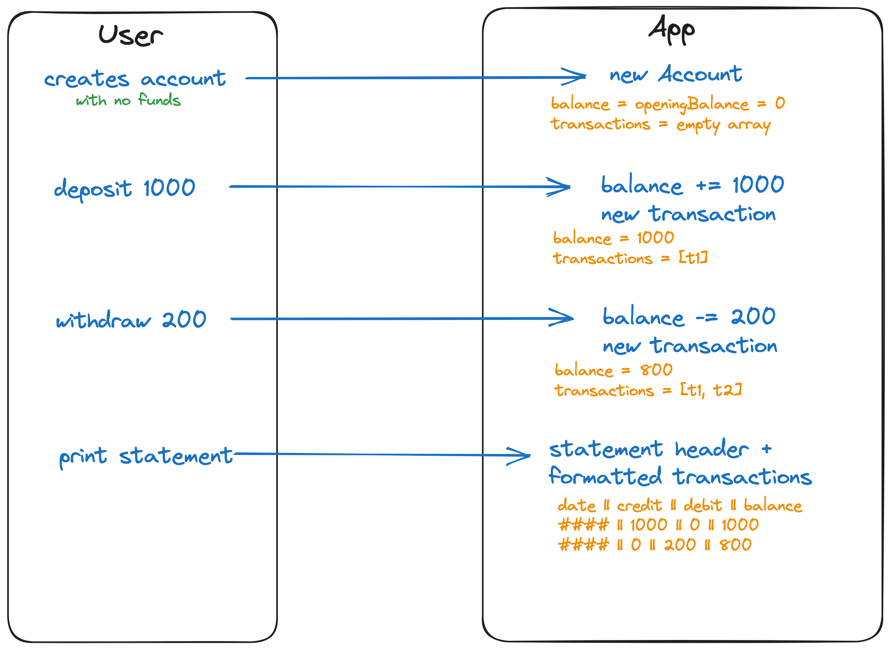
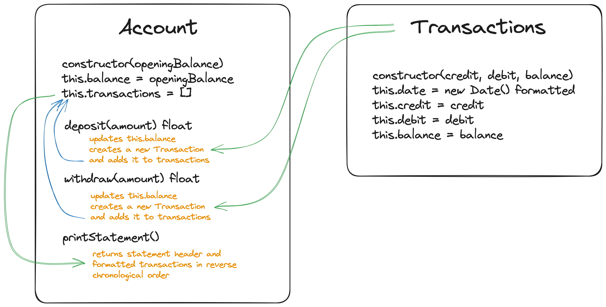
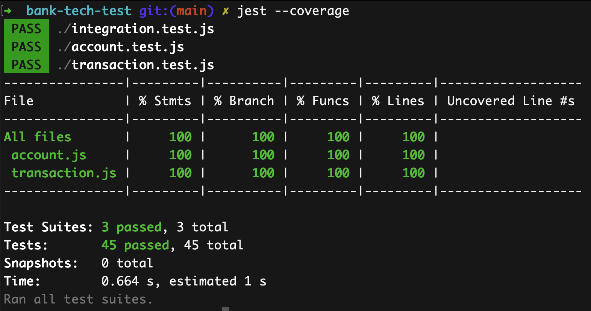
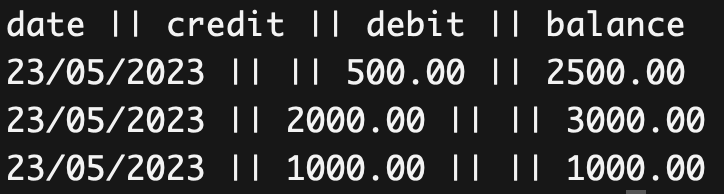

# Bank Tech Test

## Description

This is a tech test for a bank account. It is a command line application that allows a user to make deposits, withdrawals and print a statement of their transactions.

## Technologies

* JavaScript
* Jest
* Node
* ESLint
* Prettier
* Git
* GitHub
* excalidraw

## Installation

1. Clone this repository
2. Run `npm install` to install dependencies
3. Run `jest` to run tests
4. Run `jest --coverage` to run tests with coverage
5. Run `npm run lint` to run ESLint

## Example usage in Node (step by step)

1. Run `node` to open the node REPL
2. Run `const Account = require('./account.js')` to require the Account class
3. Run `const account = new Account(0)` to create a new account with a balance of 0
4. Run `account.deposit(1000)` to deposit £1000
5. Run `account.deposit(2000)` to deposit £2000
6. Run `account.withdraw(500)` to withdraw £500
7. Run `account.printStatement()` to print a statement of the transactions
8. Run `account.balance` to check the balance

## Example usage in Node (all at once)

Copy this code as a block and paste it into the node REPL `node` to run all the commands at once:
```
const Account = require('./account.js')
const account = new Account(0)
account.deposit(1000)
account.deposit(2000)
account.withdraw(500)
account.printStatement()
account.balance
```

## Specification

### Requirements (provided by Makers)

* You should be able to interact with your code via a REPL like IRB or Node.  (You don't need to implement a command line interface that takes input from STDIN.)
* Deposits, withdrawal.
* Account statement (date, amount, balance) printing.
* Data can be kept in memory (it doesn't need to be stored to a database or anything).

### Acceptance criteria (provided by Makers)

**Given** a client makes a deposit of 1000 on 10-01-2023  
**And** a deposit of 2000 on 13-01-2023  
**And** a withdrawal of 500 on 14-01-2023  
**When** she prints her bank statement  
**Then** she would see

```
date || credit || debit || balance
14/01/2023 || || 500.00 || 2500.00
13/01/2023 || 2000.00 || || 3000.00
10/01/2023 || 1000.00 || || 1000.00
```

### User Stories (based on requirements and acceptance criteria)

> As a user, 
> So that I can store my money safely,
> I would like to be able to [deposit] money into my [account].

> As a user,
> So that I can access my money,
> I would like to be able to [withdraw] money from my [account].

> As a user,
> So that I can monitor my money and spending,
> I would like to be able to [print] a [statement] of my [transactions].

### Design visualisation

User interaction with the application:


Class diagram:


### Design decisions

I derived user stories from the provide requirements and acceptance criteria.
I then used these user stories in conjunction with the requirements and acceptance criteria to create a visualisation of the user interaction with the application which informed the design of the classes and methods disucssed below after the classes and methods section.
The visualisation and diagramming process led me through several iterations of the design before starting to code, gave me a clear idea of the classes and methods I would need and helped me to identify edge cases.

### Classes

* Account(balance - float) - manages transactions and balance
* Transaction(credit - float, debit - float, balance - float) - stores transaction details with a date

### Methods

#### Account

* constructor(balance - float)
* deposit(amount - float) 
* withdraw(amount - float)
* printStatement()

#### Transaction

* constructor(credit - float, debit - float, balance - float, (constructor adds:) date - date)

### Class and method design decisions

I decided that the Account class would control the transactions and balance, while a separate Transaction class would store the details of each transaction. 
I considered the possibility of a third Statment class, but decided against this as the statement is simply a list of transactions and I felt that the Account class could easily handle this given the scale of the project.

### Edge Cases

* User cannot withdraw or deposit a negative amount
* User cannot withdraw or deposit a non-number
* User cannot withdraw or deposit a number with more than 2 decimal places
* User cannot withdraw or deposit a number with more than 500,000

I took the decision to set a transaction limit of 500,000 as an arbitrary number in consideration that above a certain amount, a bank would likely require some form of authorisation or security check. The limit could be changed by changing the value set in the `validateAmount` method in the `Account` class.

I also considered restricting withdrawals where there were insufficient funds in the account, but decided against this as it is not a requirement of the tech test and users may also have an overdraft facility.

I asked about a possible requirement to have a user account number or name, but was told that this was not a requirement of the tech test.

## Example integration tests

```
> account = new Account(0)
> account.deposit(1000)
> account.deposit(2000)
> account.withdraw(500)
> account.printStatement()
date || credit || debit || balance
14/01/2023 || || 500.00 || 2500.00
13/01/2023 || 2000.00 || || 3000.00
10/01/2023 || 1000.00 || || 1000.00
```

## Example unit tests

```
> account = new Account(0)
> account.deposit(1000)
> account.deposit(2000)
> account.withdraw(500)
> account.balance
2500
```

## Testing

I used Jest to test the application.
* There are unit tests for the `Account` and `Transaction` classes and integration tests for the user stories.
* The `Transaction` class is tested using a mock date to ensure that the date is correct when the transaction is created.
* The integration tests also use the same mock date to ensure that the date is correct when the transaction is created.
* The `Account` class is tested using a mock of the `Transaction` class to ensure that its methods are called correctly in isolation.
* All tests are passing with 100% coverage.

All tests pass with 100% coverage:


## Example output

With input matching the acceptance criteria input but with the current date: 23rd May 2023, the output is:



